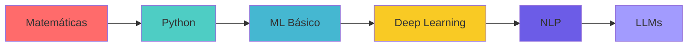

# 🚀 Guía Completa de Aprendizaje de IA desde Cero

Bienvenido a tu viaje de aprendizaje en Inteligencia Artificial. Esta guía te llevará desde los fundamentos matemáticos hasta crear tus propios LLMs y modelos avanzados.

## 📚 Estructura del Curso

### Fase 1: Fundamentos Matemáticos (2-3 semanas)
- **Álgebra Lineal**: Vectores, matrices, operaciones básicas
- **Cálculo**: Derivadas, gradientes, optimización
- **Probabilidad y Estadística**: Distribuciones, teorema de Bayes

📁 [`01-fundamentos-matematicos/`](./01-fundamentos-matematicos/)

### Fase 2: Python para IA (1-2 semanas)
- NumPy para cálculos numéricos
- Pandas para manipulación de datos
- Matplotlib/Seaborn para visualización

📁 [`02-python-para-ia/`](./02-python-para-ia/)

### Fase 3: Machine Learning Básico (3-4 semanas)
- Regresión lineal y logística
- Árboles de decisión
- K-means, KNN
- Evaluación de modelos

📁 [`03-machine-learning/`](./03-machine-learning/)

### Fase 4: Deep Learning (4-5 semanas)
- Redes neuronales básicas
- Backpropagation
- TensorFlow y PyTorch
- Redes convolucionales (CNN)

📁 [`04-deep-learning/`](./04-deep-learning/)

### Fase 5: NLP - Procesamiento de Lenguaje Natural (3-4 semanas)
- Tokenización y embeddings
- RNNs y LSTMs
- Transformers
- Modelos preentrenados

📁 [`05-nlp/`](./05-nlp/)

### Fase 6: LLMs - Large Language Models (4-6 semanas)
- Arquitectura Transformer en profundidad
- Fine-tuning de modelos
- Creación de chatbots
- RAG (Retrieval Augmented Generation)

📁 [`06-llms/`](./06-llms/)

## 🎯 Proyectos Prácticos

1. **CNN con TensorFlow Hub**: Clasificación de imágenes
2. **Análisis de Sentimientos**: NLP básico
3. **Chatbot Simple**: Aplicación de transformers
4. **Mini-LLM**: Entrenar un modelo de lenguaje pequeño

📁 [`proyectos/`](./proyectos/)

## 🛠️ Herramientas Necesarias

```bash
# Instalar dependencias básicas
pip install numpy pandas matplotlib seaborn scikit-learn
pip install tensorflow torch torchvision
pip install transformers datasets
pip install jupyter notebook
```

## 📖 Cómo Usar Esta Guía

1. **Sigue el orden**: Cada fase construye sobre la anterior
2. **Practica diariamente**: Los ejemplos están diseñados para ser ejecutables
3. **No te saltes las matemáticas**: Son fundamentales para entender cómo funcionan los modelos
4. **Experimenta**: Modifica los ejemplos y crea tus propias variaciones

## 🎓 Recursos Adicionales

- **Cheat Sheets**: Hojas de referencia rápida en cada carpeta
- **Ejercicios**: Problemas para practicar al final de cada sección
- **Soluciones**: Disponibles en carpetas `soluciones/`

## 📈 Progreso Recomendado



## ⏱️ Tiempo Estimado Total

**4-6 meses** dedicando 2-3 horas diarias

---

> 💡 **Consejo**: No te apures. Es mejor entender bien cada concepto que avanzar rápido sin comprenderlos.

¡Comienza con la Fase 1 y disfruta el viaje! 🚀
